# 8INF846
Ce repos regroupe les differents TP d'IA pour le cours de 8INF846 proposé par Mr Rabeh Ayari.

Code développé par :
- Mathias DURAND 
- Sophie GERMAIN 
- Pierre LACLAVERIE 
- Barnabé PORTIER 

# TD1 Aspirateur et parcours non-informés et informés
[Sujet](ress/pdf/Sujet1.pdf)
[Rapport](ress/pdf/Rapport_TP1.pdf)

## Objectif : Création d’un agent aspirateur 
Le sujet se concentre sur la modélisation du nettoyage par un robot aspirateur intelligent d’une zone de 5x5. Trois éléments vont impacter le cours de la vie du robot: l’apparition d’une poussière, l’apparition d’un diamant et l’action d’aller aspirer le diamant.
L’objectif de ce programme est de modéliser ces trois grandes phases. Il est à noter que les diamants ainsi que les particules de poussière à aspirer apparaissent de manière aléatoire tout au long de l’exécution du programme.

Pour cela, nous avons décider d'implémenter la solution en utilisant le multithreading python.

Un thread pour la création et mise à jour de l'environnement et un thread uniquement pour l'agent. Ils sont lancés à partir du thread 'principal'.

Pour un affichage plus lisible, nous avons mis un thread.sleep(), sinon les informations défilaient beaucoup trop vite.

## Méthode et algorithme

### Modélisation de l'agent

Nous avons modélisé l'agent comme ayant la partie logique -agent.py-, la partie capteur -capteur.py- et la partie effecteur -effecteurs.py-.

### Méthode non informée

Pour répondre à la problématique, nous avons implémenter un algorithme non informé, le __bread-first search__. Celui-ci permet une recherche sans que l’agent n’ait de connaissance globale de l’environnement. 

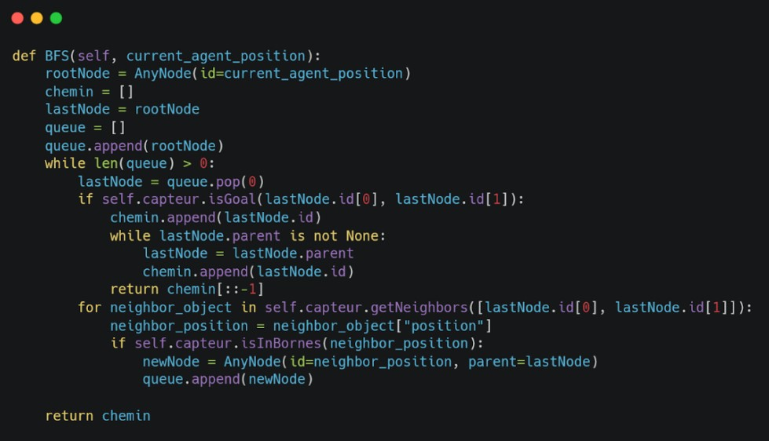

### Méthode informée

Après avoir exécuté l’algorithme d’exploration non informé, le programme va exécuter notre algorithme d’exploration informée. Celui-ci consiste en __l’algorithme A*__ que nous avons adapté à notre contexte. Nous avons choisit de fixer a ((nb_cases)**2 - nb_cases) /2 + nb_cases iterations de BFS pour avoir un resultat satisfaisant pour utiliser A star. Ce Polynome nous a semble convenable car le nombre d'iteration grandi en suivant le carre du nombre de lignes (ou de colonnes, mais nous utilisons forcement un board carré). 

En prérequis, le Breadth-First-Search doit avoir été exécuté suffisamment de fois pour que la matrice d’adjacence des coûts, notre métrique, ait été intégralement remplie (i.e. que le robot ait fait chaque chemin au moins une fois). Cette matrice d’adjacence est utilisée pour calculer les chemins dans A*.

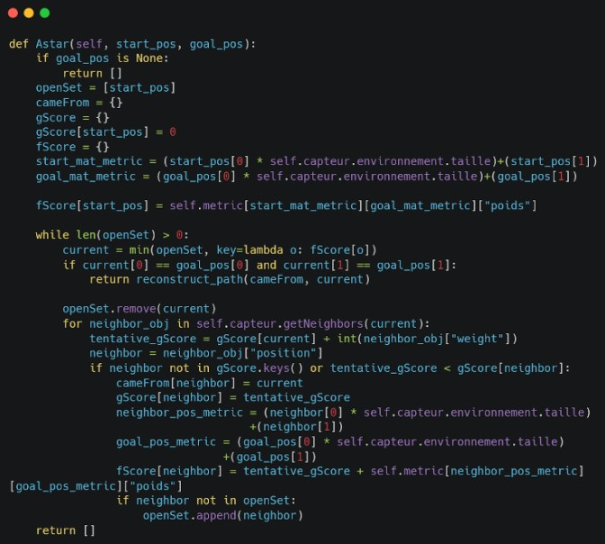

## Resultat 

Première phase : apprentissage avec la méthode non-informée

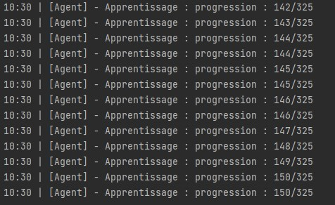

Deuxième phase : utilisation de la méthode informée

Transition :

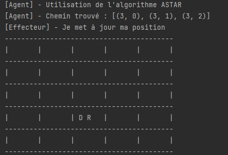

Quelques autres exemples de retour
Choix de ramasser un bijoux et generer une poussiere en même temps

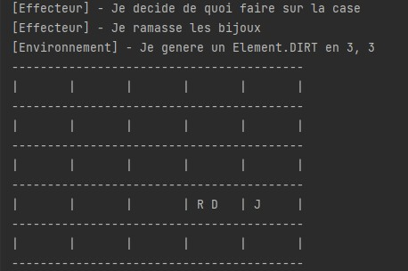

Generer aléatoirement

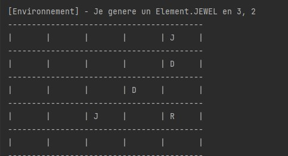

# TD2 Generer et resoudre un Sudoku

## Objectif : Resoudre automatiquement un Sudoku

Le sujet consiste en le développement d’un programme capable de résoudre un sudoku généré aléatoirement ou fourni par l’utilisateur.
L’objectif de ce programme est d’utiliser deux algorithmes de résolution de Problèmes de Satisfaction de Contraintes (CSP) afin de répondre au sujet. 

## Méthodes 

Pour résoudre ce problème nous avons implémenté deux méthodes : AC3 et Backtracking. 
Si dans le cas d’utilisation de l’AC3 avec le nombre de cases pré-remplies par défaut, la complétion de la table est quasi-instantanée, l’algorithme de backtracking est un peu plus long, mettant entre 1 et 15 secondes à trouver une solution. En augmentant le nombre d’indices à 50 ce temps diminue à 4 secondes.

### Backtracking

La méthode a été implémentée via la classe `Backtracking.py`, un extrait de code y est présenté ici. C'est RecuriveBackTracking qui est utilisé principalement. Le code est disponible [ici](TP2/Backtracking.py)
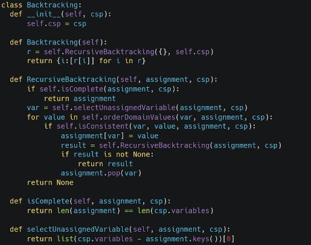

### AC3 

La méthode a été implémentée via la classe `AC3.py`, La methode est presentee ici. La classe en son entieretee est disponible [ici](TP2/AC3.py) 

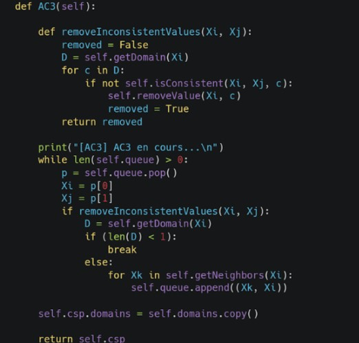

## Resultats 
Le choix de l'algorithme se donne en argument du script. Par defaut, AC3.

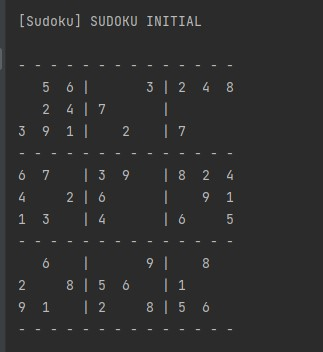

Ensuite la solution est generee. AC3

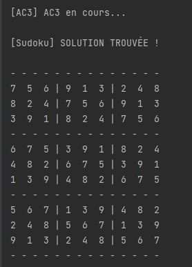

Backtracking

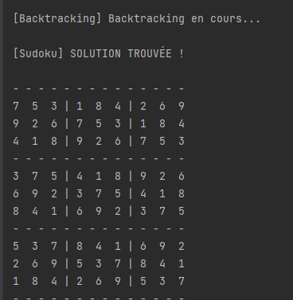

# Le robot qui sauve des vies

## Objectif 

On souhaite modéliser une intelligence artificielle, sous la forme d’un système expert, capable de diriger un robot dans une zone dévastée notamment par des incendies et des décombres, afin d’y trouver un survivant. Pour accomplir sa tâche, le robot dispose de capteurs capables de détecter de la chaleur, des incendies, des cris, de la poussière et des décombres. Dans notre modélisation, ses déplacements sont limités. Le robot se déplace sur une grille et ne peut aller que vers le haut, le bas, la droite ou la gauche, et pas en diagonale. L’agent peut échouer s’il s’enlise dans les décombres mais peut éteindre un feu. Le robot n’a aucune limite de temps ou d’action, il peut continuer jusqu’à être coincé par les décombres ou qu’il ait trouvé le survivant.

## Methode et algorithme 

## Methode
Nous avons modélisé la solution à l’aide des classes Python suivantes.
Environnement : définit l’environnement (carte des lieux, probabilités …)
Agent : définit l’agent intelligent, qui analyse son environnement proche avec son Capteur, se déplace et peut interagir avec l’environnement grâce à son Effecteur 
Capteur : permet à l’agent d’analyser l’environnement et ses cases
Effecteur : permet à l’agent d’agir sur l’environnement : se déplacer, éteindre un feu, sauver la victime …

L’Agent commence par charger son environnement. Il utilise ensuite son Capteur pour déterminer l’état des cases sur lesquelles il peut se déplacer. L’Agent décide ensuite de sa prochaine action, il appelle alors l’Effecteur pour la réaliser.

## Methode

Pour pouvoir arriver a ce resultat, l'agent ne peut voir que a une seule case autour de lui. Il va chercher a savoir qu'est ce qui probablement etre pour le voisin du voisin. 

Par exemple si le voisin de droite est une poussiere, le voisin de la poussiere est forcement un decombre.... la question est quel voisin? Peut-il y avoir plusieurs voisins qui sont des decombres?
Au cours des iterations et du scan de chaque voisin, l'Agent va emettre des hypotheses et va les corroborer avec ce qu'il voit a l'aide de ses capteurs pour mettre a jour sa matrice de representation de l'espace. Plus d'information sur [le code source](TP3/Agent.py)

L'agent va calculer quel serait le meilleur chemin en prenant en compte les possibilites. Il va monter en niveau jusqu'a sa mort i.e tomber dans les combles
## Resultat

Legende :
- V : Victime a sauver
- W : cris de la victime
- A : Agent
- H : Heat, chaleur degagee par le Foyer 
- F : Foyer, degage de la chaleur H
- R : Rumble, decombres, seul etat qui peut tuer notre agent
- D : Dust, degagée par des decombres
  

Par defaut, le niveau initial est de trois (3), il augmente a chaque fois jusau'a que le robot echoue.

Par exemple, voici un exemple de grille 3x3 

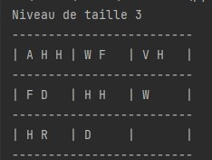

Ensuite, le detail des actions effectuées est donné 

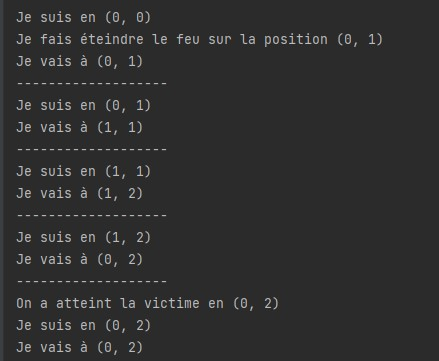

Et enfin en cas de reussite, la conclusion puis le passage au niveau superieur 
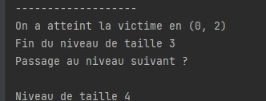

Dans notre lance, au niveau 5 il n'a pas reussi a sauver la victime 

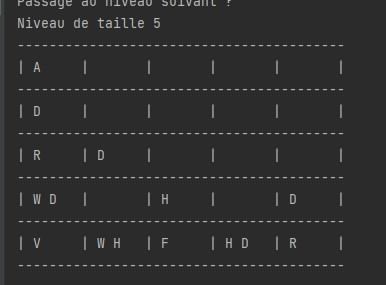

En effet la victime est en bas à gauche de l'écran, elle est entourée de décombres. L'agent n'aura d'autre choix pour s'approcher d'elle que de sombrer dans les décombres.

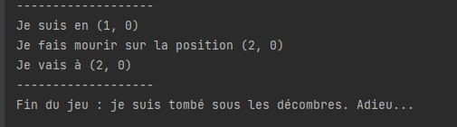
